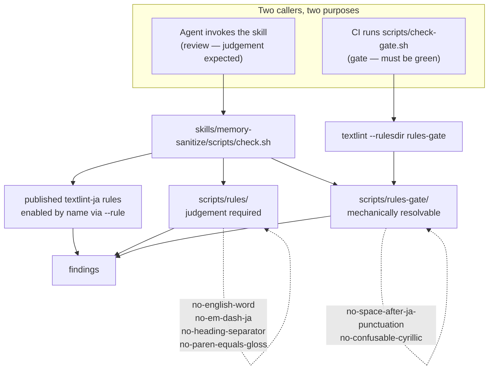

# memory-sanitize — Design Notes

Implementation reference for contributors. Companion to the user-facing overview
in [`../README.md`](../README.md). This file documents the rule taxonomy
introduced in v1.1.0 and the two verification paths that consume it.

Produced as the architecture artifact required by [`../CLAUDE.md`](../CLAUDE.md)
("Design Changes Require Architecture Diagrams"). It was written after the
v1.1.0 PR merged rather than before it, which is a process failure recorded
here so the omission is visible rather than silent.

## 1. Goals and constraints

- **Detect, never fix.** The skill reports; a human or agent decides each
  change. No `--fix` is wired up, even for rules that support it.
- **Reproducible across environments.** `--no-textlintrc` blocks whatever
  config the user's environment carries, so the same input yields the same
  findings anywhere.
- **No persistent install.** `npx` resolves everything per run; the skill
  directory never grows a `node_modules`.
- **Prefer published rules.** A rule is written here only when no published
  textlint rule covers the case, or when every published option produces
  false positives that cannot be scoped away. The rejection is recorded.
- **A gate must be green-able.** Some findings need editorial judgement and
  cannot be driven to zero mechanically. Those must not block CI, or the gate
  becomes noise that everyone learns to ignore.
- **The skill owns no paths.** Targets are supplied by the caller. The skill
  states what kind of file qualifies and refuses to guess locations.

## 2. Architecture

The split between `scripts/rules/` and `scripts/rules-gate/` is a directory
split rather than a config flag. That is forced by textlint: `--rulesdir`
enables every rule in the directory it is given, and a config file's `false`
entries do not override it. Selecting a subset therefore requires a separate
directory. This was measured, not assumed.

## 3. Rule taxonomy

The dividing question is: **can a caller drive this rule's findings to zero
without making an editorial decision?**

| Directory | Rules | Why it sits there |
|---|---|---|
| `scripts/rules-gate/` | `no-space-after-ja-punctuation`, `no-confusable-cyrillic` | Resolved by deleting a space or replacing a character. No wording judgement. |
| `scripts/rules/` | `no-english-word`, `no-em-dash-ja`, `no-heading-separator`, `no-paren-equals-gloss` | Resolved by translating a word, curating an allow-list, or rewriting a sentence. |

Running the full set across this repository produces 146 findings, most of them
English prose that is correct as written. That is the observed number behind
the "a gate must be green-able" constraint above: the full set cannot serve as
a pass/fail gate here.

## 4. Published rules: adopted and rejected

- **Adopted — `ja-no-space-between-full-width`.** Covers a half-width space
  between two full-width word characters, and exempts katakana compounds
  (`エージェント スキル` is a compound separator, not a defect). A hand-rolled
  regex written here did not carry that exemption and flagged it. Zero findings
  across the author's four norm files, so it is noise-free in practice.
- **Rejected — `ja-no-space-around-parentheses`.** Covers spaces around
  `[]（）［］「」『』`. It exposes no options at all; its only filter is
  `isPlainStrNode`. Across the author's norm files it produced 15 findings,
  10 of them on English template lines such as `**Issue**: [Description]`,
  where it reads half-width `[]` as brackets. There is no way to scope it to
  Japanese text the way `no-english-word` does.
- **Gap — no published rule covers a space directly after `。` or `、`.** The
  preset ships `ja-space-after-exclamation` and `ja-space-after-question` but
  no punctuation equivalent. Configuring
  `ja-space-between-half-and-full-width` with `space:"never"` and
  `exceptPunctuation:false` does reach that case, but it also rejects
  `import と関数`, which is correct Japanese typography. Hence
  `no-space-after-ja-punctuation`.

## 5. Node coverage of the custom rules

`no-space-after-ja-punctuation` inspects `Str` only. Code is excluded by
textlint's standard behaviour, which is wanted: documentation has to be able to
quote the sequence it forbids.

`no-confusable-cyrillic` inspects `Str`, `Code`, **and** `CodeBlock`. This is a
deliberate departure. A Cyrillic character hidden inside a command is worse
than one in prose because it fails only at execution time. The raw `grep` this
rule replaced saw code, so a `Str`-only rule would have been a regression.

Greek is out of scope: `λ`, `μ`, `π`, `Ω` are legitimate in technical writing,
so including Greek would trade one silent defect for a stream of false
positives.

## 6. The CI gate

`scripts/check-gate.sh` implements no rule. It selects targets and invokes
textlint against `scripts/rules-gate/`. An earlier draft reimplemented the
spacing check as a perl regex; the same rule then existed in three places and
drifted within a day.

Two behaviours are worth noting because they are not obvious:

- **`@textlint/textlint-plugin-text`** is what lets textlint read `.sh`, `.js`
  and `.py` at all. Without it textlint handles only Markdown and plain text,
  and the Japanese comments in shell and JavaScript sources go unchecked.
- **Inline code spans are replaced with an ASCII placeholder, not deleted.**
  Deleting them joins the spaces that correctly surround inline code, which
  then reads as two full-width characters separated by a space and reports a
  false positive.

Excluded paths: everything under `session-tts/`, any `tests/` directory, and
the gate script itself. All three necessarily contain the sequences the rules
forbid — as test fixtures, as assertions, or as documentation of the pattern.

## 7. Known process gap

This document exists because the v1.1.0 change was structural and shipped
without it. `CLAUDE.md` requires the diagram *before* code review or PR
creation, and treats it as a verification artifact rather than documentation.
Writing it after the fact recovers the artifact but not the verification: the
design was not forced through this articulation before it merged.
